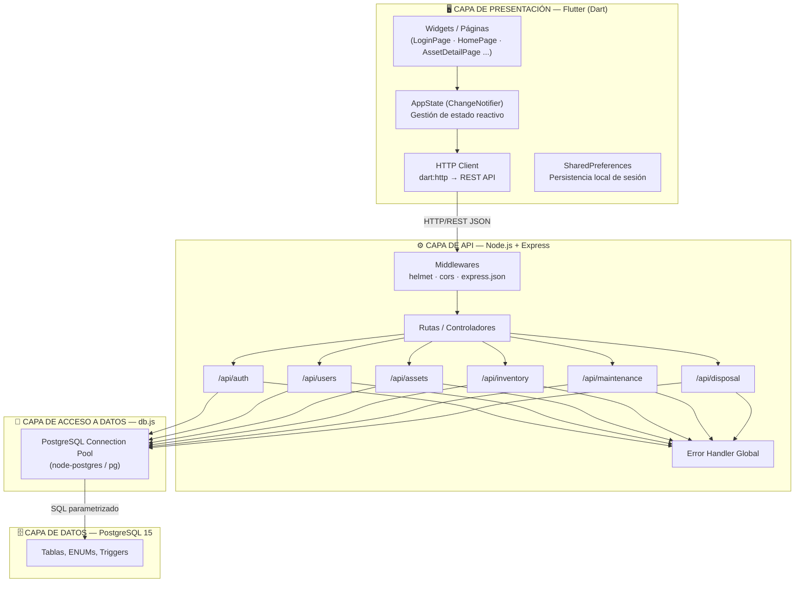
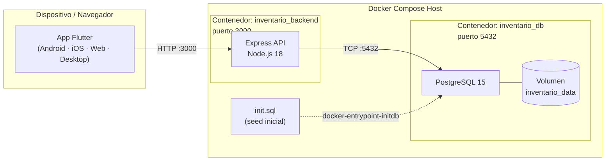
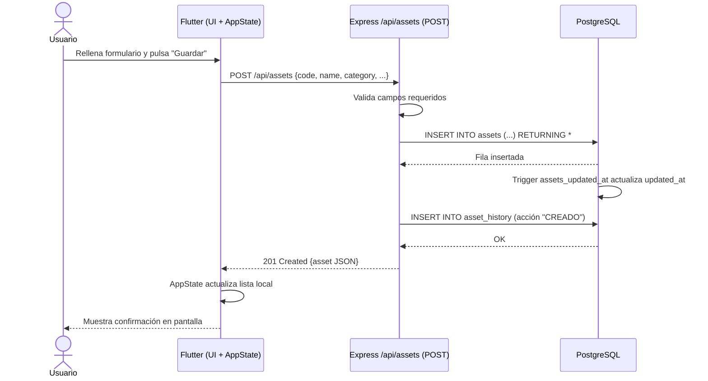
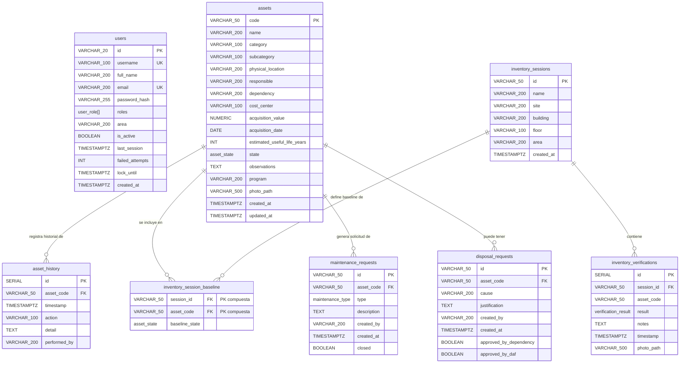

# Arquitectura del Sistema de Gestión de Inventario Institucional

---

## Tabla de Contenidos

1. [Descripción General](#1-descripción-general)
2. [Arquitectura Seleccionada: Por Capas (Layered Architecture)](#2-arquitectura-seleccionada-por-capas-layered-architecture)
   - 2.1 [¿Por qué NO Microservicios?](#21-por-qué-no-microservicios)
   - 2.2 [¿Por qué NO MVC puro?](#22-por-qué-no-mvc-puro)
   - 2.3 [¿Por qué SÍ Arquitectura por Capas?](#23-por-qué-sí-arquitectura-por-capas)
3. [Vista de Capas del Sistema](#3-vista-de-capas-del-sistema)
4. [Vista de Componentes y Despliegue](#4-vista-de-componentes-y-despliegue)
5. [Flujo de una Petición Típica](#5-flujo-de-una-petición-típica)
6. [Diagrama de Base de Datos (ER)](#6-diagrama-de-base-de-datos-er)
   - 6.1 [Descripción de las Tablas](#61-descripción-de-las-tablas)
   - 6.2 [Tipos y Enumeraciones](#62-tipos-y-enumeraciones)
   - 6.3 [Relaciones](#63-relaciones)
7. [Stack Tecnológico](#7-stack-tecnológico)

---

## 1. Descripción General

El sistema es una aplicación de **gestión de inventario institucional** compuesta por tres componentes principales que se comunican entre sí:

| Componente | Tecnología | Rol |
|---|---|---|
| **Cliente** | Flutter (Dart) | Interfaz de usuario multiplataforma |
| **Backend** | Node.js + Express | API REST — lógica de negocio |
| **Base de datos** | PostgreSQL 15 | Persistencia de datos |
| **Infraestructura** | Docker / Docker Compose | Orquestación de contenedores |

---

## 2. Arquitectura Seleccionada: Por Capas (Layered Architecture)

> **Veredicto: Arquitectura por Capas (N-Tier / Layered Architecture)**
> con patrones de Repositorio en el backend y presentación reactiva en el cliente.

### 2.1 ¿Por qué NO Microservicios?

| Criterio | Microservicios | Este proyecto |
|---|---|---|
| Número de servicios backend | Múltiples procesos independientes | **Un solo proceso Express** |
| Bases de datos | Cada servicio tiene la suya | **Una sola base de datos PostgreSQL** |
| Comunicación | Event bus / gRPC / HTTP entre servicios | Llamadas directas al pool SQL dentro del mismo proceso |
| Despliegue | Orquestador (K8s) complejo | **Docker Compose con 2 contenedores** |
| Equipo requerido | Equipos grandes distribuidos | Proyecto académico / PYME |

Los módulos (`auth`, `users`, `assets`, `inventory`, `maintenance`, `disposal`) son **rutas Express dentro del mismo proceso**, no servicios independientes. Comparten la misma conexión a la base de datos (`db.js`). Esto descarta por definición la arquitectura de microservicios.

### 2.2 ¿Por qué NO MVC puro?

El patrón MVC clásico asume que el servidor renderiza vistas (HTML). En este proyecto:

- **No hay vistas en el servidor** — el backend solo devuelve JSON.
- La "vista" vive completamente en **Flutter** (cliente desacoplado).
- El backend no tiene capa de plantillas (no hay Handlebars, EJS, etc.).

Aunque conceptualmente los **routes** de Express cumplen el rol de Controlador y las tablas PostgreSQL cumplen el rol de Modelo, el MVC clásico no aplica como patrón completo dado que el View reside en un proceso y plataforma completamente diferente.

### 2.3 ¿Por qué SÍ Arquitectura por Capas?

El proyecto exhibe una separación limpia e inequívoca en capas:

```
┌─────────────────────────────────────────────────────┐
│         CAPA DE PRESENTACIÓN (Flutter)              │
│   Widgets • AppState • HTTP Client (dart:http)      │
├─────────────────────────────────────────────────────┤
│         CAPA DE API / CONTROLADORES (Express)       │
│   Routes: auth · users · assets · inventory         │
│           maintenance · disposal                    │
│   Middlewares: helmet · cors · json · error handler │
├─────────────────────────────────────────────────────┤
│         CAPA DE ACCESO A DATOS (db.js)              │
│   PostgreSQL Pool (pg) — consultas parametrizadas   │
├─────────────────────────────────────────────────────┤
│         CAPA DE DATOS (PostgreSQL 15)               │
│   Tablas · ENUMs · Triggers · Transacciones         │
└─────────────────────────────────────────────────────┘
```

**Justificaciones concretas:**

1. **Separación de responsabilidades verificable en el código:**
   - `db.js` → única responsabilidad: gestionar el pool de conexiones.
   - Cada archivo en `routes/` → única responsabilidad: manejar un dominio de negocio.
   - `index.js` → única responsabilidad: ensamblar middlewares y registrar rutas.
   - `main.dart` → presenta la UI y delega lógica al `AppState`.

2. **Comunicación estrictamente vertical:** Flutter llama al backend vía HTTP REST; el backend llama a PostgreSQL vía el pool SQL. Ninguna capa se salta a otra.

3. **Independencia de despliegue por capa:** Flutter puede correr en Android, iOS o Web sin cambiar el backend. El backend puede escalar sin tocar la UI. La base de datos puede migrarse sin modificar el código de la API (solo las queries).

4. **Adecuación al tamaño del proyecto:** La arquitectura por capas es la más apropiada para un proyecto académico / institucional de este tamaño porque minimiza la complejidad operacional (solo 2 contenedores Docker) sin sacrificar mantenibilidad.

---

## 3. Vista de Capas del Sistema



---

## 4. Vista de Componentes y Despliegue



---

## 5. Flujo de una Petición Típica

> Ejemplo: el auxiliar de inventario registra un activo nuevo.



---

## 6. Diagrama de Base de Datos (ER)



---

### 6.1 Descripción de las Tablas

| Tabla | Dominio | Descripción |
|---|---|---|
| `users` | Seguridad | Usuarios del sistema con roles RBAC, control de bloqueo por intentos fallidos y auditoría de última sesión. |
| `assets` | Inventario | Catálogo maestro de activos fijos institucionales. Es la tabla central referenciada por todas las demás. |
| `asset_history` | Trazabilidad | Log inmutable de cambios realizados a cada activo (quién, cuándo, qué acción). |
| `inventory_sessions` | Verificación | Sesiones de toma física de inventario, asociadas a un sitio, edificio y área específicos. |
| `inventory_session_baseline` | Verificación | Snapshot del estado esperado de cada activo al inicio de una sesión (tabla puente N:M). |
| `inventory_verifications` | Verificación | Registros del resultado real de cada activo verificado durante una sesión (incluyendo foto y notas). |
| `maintenance_requests` | Mantenimiento | Solicitudes de mantenimiento preventivo o correctivo asociadas a un activo. |
| `disposal_requests` | Bajas | Solicitudes de baja o disposición final de activos, con flujo de aprobación por dependencia y DAF. |

### 6.2 Tipos y Enumeraciones

| Tipo ENUM | Valores |
|---|---|
| `user_role` | `auxiliarInventario`, `administrador`, `responsableArea`, `direccionAdminFin`, `auditor`, `soporteTI` |
| `asset_state` | `activo`, `reubicado`, `noEncontrado`, `obsoleto`, `enReparacion`, `paraBaja` |
| `verification_result` | `encontrado`, `reubicado`, `noEncontrado`, `paraBaja`, `obsoleto`, `enReparacion` |
| `maintenance_type` | `preventivo`, `correctivo` |

### 6.3 Relaciones

| Relación | Cardinalidad | Regla de integridad |
|---|---|---|
| `assets` → `asset_history` | 1 : N | `ON DELETE CASCADE` — si se elimina un activo, se elimina todo su historial. |
| `assets` → `inventory_session_baseline` | 1 : N | `ON DELETE CASCADE` — clave compuesta `(session_id, asset_code)`. |
| `inventory_sessions` → `inventory_session_baseline` | 1 : N | `ON DELETE CASCADE` — tabla puente de la relación N:M sesión/activo. |
| `inventory_sessions` → `inventory_verifications` | 1 : N | `ON DELETE CASCADE` — cada verificación pertenece a una sesión. |
| `assets` → `maintenance_requests` | 1 : N | `ON DELETE CASCADE` — un activo puede tener múltiples solicitudes de mantenimiento. |
| `assets` → `disposal_requests` | 1 : N | `ON DELETE CASCADE` — un activo puede tener múltiples solicitudes de baja. |

> **Nota sobre `inventory_verifications.asset_code`:** este campo no tiene FK declarada en la base de datos (flexible por diseño), lo que permite registrar verificaciones de activos escaneados que aún no estén en el catálogo.

---

## 7. Stack Tecnológico

```mermaid
graph LR
    subgraph FRONTEND
        F1["Flutter 3.x (Dart)"]
        F2["material3 · google_fonts"]
        F3["mobile_scanner (QR/código de barras)"]
        F4["image_picker · pdf (generación de reportes)"]
        F5["shared_preferences (sesión local)"]
        F6["http (REST client)"]
    end

    subgraph BACKEND
        B1["Node.js 18 + Express 4"]
        B2["helmet (HTTP security headers)"]
        B3["cors (Cross-Origin)"]
        B4["pg / node-postgres (pool SQL)"]
    end

    subgraph DATABASE
        D1["PostgreSQL 15-alpine"]
        D2["pgcrypto (bcrypt passwords)"]
        D3["Trigger set_updated_at"]
        D4["ENUM types · Arrays"]
    end

    subgraph INFRA
        I1["Docker Compose 3.9"]
        I2["Health check (pg_isready)"]
        I3["Volumen persistente inventario_data"]
    end

    FRONTEND -- "HTTP REST / JSON" --> BACKEND
    BACKEND -- "TCP / SQL" --> DATABASE
    INFRA -. "orquesta" .- BACKEND
    INFRA -. "orquesta" .- DATABASE
```



---

*Documento generado a partir del análisis del código fuente del repositorio.*
*Última actualización: Abril 2026*
